# Robot Localization
The code in this repository implements a ParticleFilter, which is tested on board a simulated Neato (robotic vacuum equipped with a LiDAR) using ROS bagfiles that are collected from a physical platform. This was created as part of the Olin Computational Robotics class in Fall 2020 as part of the Robot Localization project.

Contributors:
[Amy Phung](https://github.com/AmyPhung),
[Eamon O'Brien](https://github.com/EamonCOBrien),
[Emma Pan](https://github.com/epan547)

## At-a-glance 
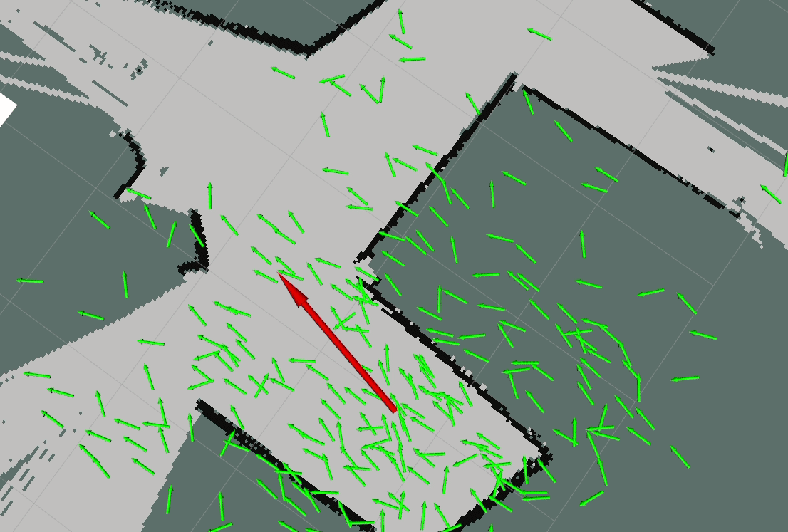

We primarily tested with the `ac109_1` bagfile, which contained data collected by a physical Neato robotic vacuum equipped with a LiDAR operated in a classroom environment. This bagfile included:
+ a map generated by the [gmapping ROS package](http://wiki.ros.org/gmapping)
+ LiDAR scans
+ a continuous odometry estimate from encoders
+ a “ground truth” pose estimate, determined by using AprilTag fiducials mounted on the ceiling 

We used the following command to develop and test our implementation
```
roslaunch robot_localizer test_bagfile.launch map_name:=ac109_1
```
Eventually, we did end up testing with all of the provided bagfiles, and those results can be viewed at the end of this document.
#### Highlighted Features
+ The noise added during the resampling step is scaled based on the current particle cloud variance instead of being fixed
+ We implemented a custom visualization node that displays particle messages and weights in RVIZ (the coloring range also dynamically scales with the current range of the data)
+ We also created a dynamic reconfigure window to help with parameter tuning and experimentation
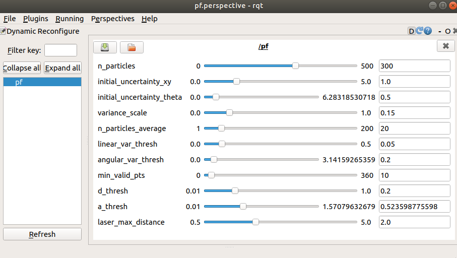
## Details
#### Project goal
The objective of implementing a ParticleFilter is to create a method for figuring out where the robot is within a known map. Although there are mathematically straightforward ways to compute this, there are usually runtime considerations that prevent these from being implemented as-is. In a particle filter, we attempt to compute a "good enough" approximation by tracking and updating a series of poses, which we assign weights to that represent our level of confidence in that particular pose.
#### What we did
The following steps are implemented in our ParticleFilter:

+ Create a series of particles with varying positions and poses around our initial estimate (high uncertainty, lots of variation)
+ Compute weights for each particle
	+ Line up the center of the lidar data with the particle
	+ For each point in the lidar, compute what map position that'd be using the following pseudocode:
	```
            x  = particle.x + point_r*cos(point_theta + particle.theta)
            y  = particle.y + point_r*sin(point_theta + particle.theta)
	```
	+ For each of the projected lidar points, compute the distance to the nearest point in the map
   	+ If the projection is off the map, discard the projection
	+ Compute the average distance between the projection and the map
	+ Create a weight value that is inversely proportional to the distance
+ Normalize weights (adjust weights such that their sum equal 1)
+ Update most likely robot pose (computed by averaging the x,y, and theta of the top 20 or so particles)
+ Resample particles (randomly choose particles from a weighted set, add noise that is proportional to the variance)
+ Update particles with the odometry (move all of the particles based on movement reported by the robot’s encoders) using the following pseudocode:
```
r = distance(prev_pose, current_pose)
for each particle in the particle cloud:
        particle.x += r*cos(particle.theta)
        particle.y += r*sin(particle.theta) 
```
+ Go back to the compute weights step and repeat the process

#### Key Design Decisions
We worked from the scaffolded template, which handled conversions between the ROS messages and a custom `Particle` and `ParticleFilter` class implemented in Python. Within the original template, the particle cloud generated within the `ParticleFilter` was visualized using the default RVIZ PoseArray, which looks like this 

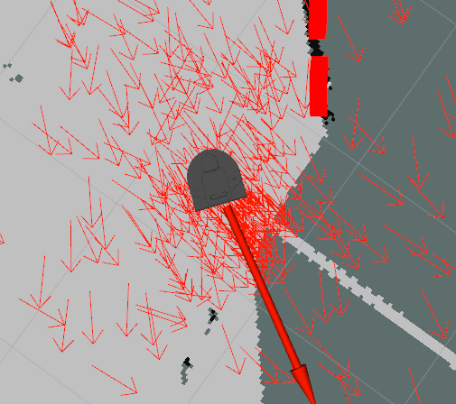

One drawback of this visualization is that it does not provide a way for us to visualize weights of the poses since the color, size, and alpha of the arrows must be uniform for the whole array. However, we believed visualizing the weights would be particularly useful for debugging and improving the implementation, so we created a `ParticleVisualizer` class that ran as a separate ROS node. To connect the particle filter node with the visualization node, we needed a way to pass messages that contained both pose and weight information, which the `PoseArray` message did not encode. Because of this, we created two custom ROS messages: a `Particle` and a `ParticleArray`
```
# Particle ROS Message - represents a weighted pose
geometry_msgs/Pose pose
float32 weight
```
```
# ParticleArray ROS Message - represents an array of weighted poses
std_msgs/Header header
Particle[] particles
```
We then modified the template to publish `ParticleArray` messages, and added a subscriber to this topic in the `ParticleVisualizer`. From here, the particle visualization node converts the contents of this message to an RVIZ `MarkerArray`, where the color of each particle scales with the particle weight. Particles with a higher weight are colored in green, and those with a lower weight are colored in red. The results are pictured below 

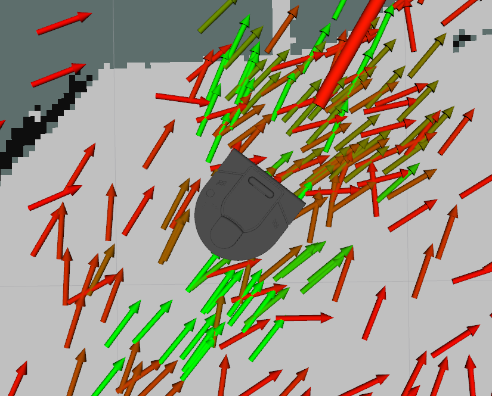

In our early versions, the particles in our cloud started with a random orientation. However, similar to how the cloud is centered on the position of the robot, we made the particles initialize in a range close to the real orientation. Later in development, we linked the noise we injected into the resampling process 
#### Notable Challenges
Debugging the `update_particles_with_odom` function (computed weights based on scan data) was a challenge - we originally didn’t visualize it, and just assumed it was working because the particle array looked correct. For example, this is what our weights looked like when our lidar data wasn’t being projected onto the map frame properly

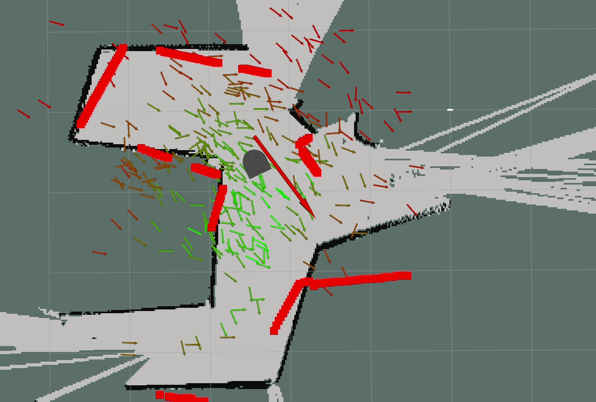
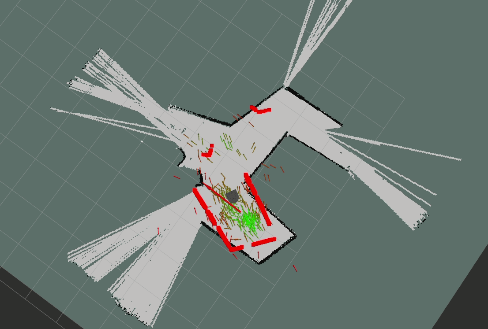

However, after visualizing it we found that we mistakenly assumed something was in degrees when it was in radians, so the lidar data wasn’t being used properly. 
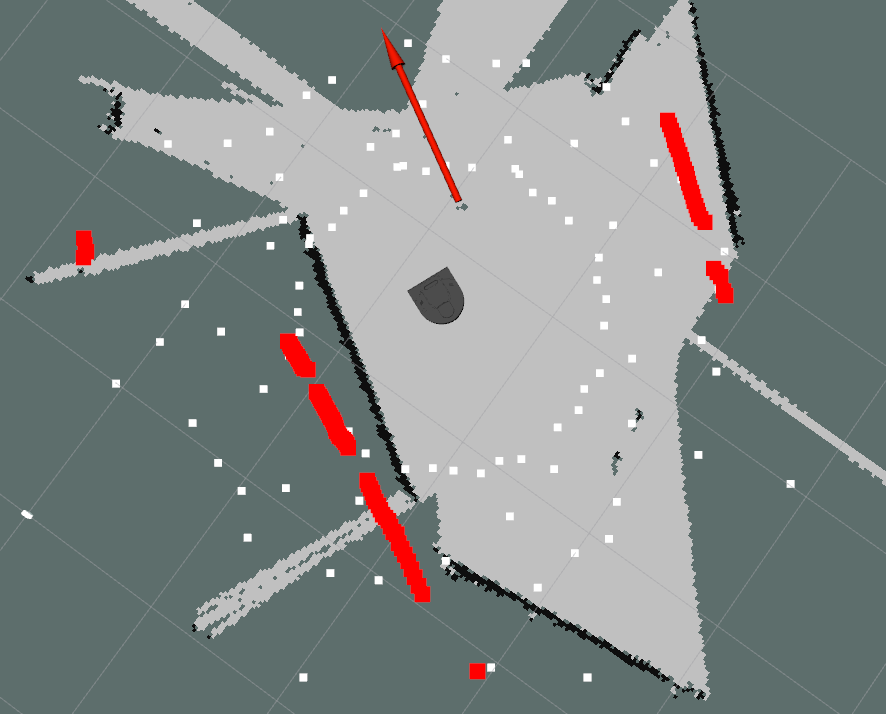
After fixing the lidar projection function, our visualization made it evident that we did in fact fix the issue

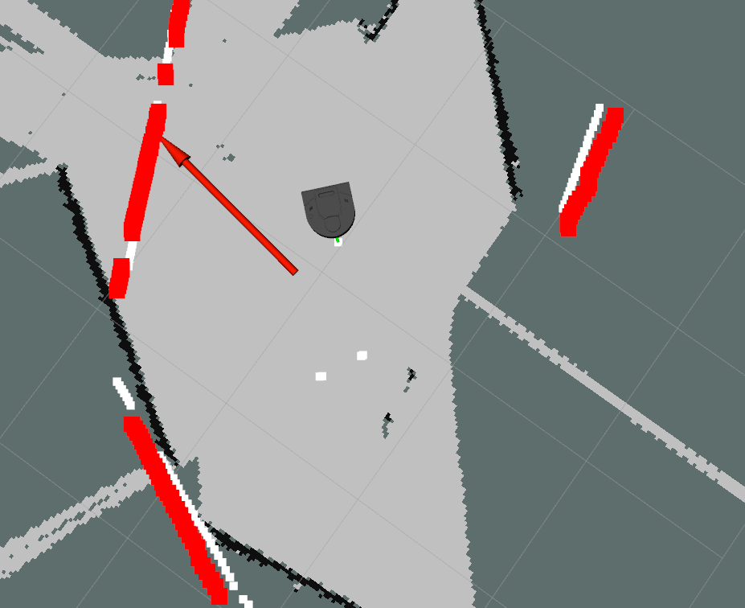

Other challenges included:
+ Parameter tuning
+ Testing in parallel before pieces were fully implemented
+ Learning how to work with ROS .launch files
+ Keeping track of many reference frames
+ Debugging after integration, when we were unfamiliar with each other’s code
+ Not knowing if behavior was a mistake, or natural error in the algorithm
+ Keeping track of signs on angles with multiple transforms
#### Potential improvements
Below, we have listed the possible improvements that we would have explored in this project, if  we were given more time: 
+ Creating 2d graphs of error from ground truth prediction over time: would help us visualize the accuracy of our particle filter, and compare performance across multiple maps and iterations.
+ Implement the ray tracing function
+ Full range evenly distributed particle cloud when initialized
+  Use mode instead of mean to improve ‘best guess’ functionality (in update_robot_pose)
#### Lessons Learned
Beyond our learning about particle filters throughout this project, we learned some more widely applicable skills and lessons to keep in mind for future technical projects and asynchronous collaboration. 

The first technical lesson we learned was that up front work on visualization saved an immense amount of time and paid off early. Another consideration was environment set-up. Two of our group members were using ROS Noetic, while one group member was still running ROS Melodic. As a result, our code would sometimes run on one distribution, but not the other. To help navigate around this issue, communicating early and often about the discrepancies in our work environments was crucial to ensuring that we didn’t get blindsided by incompatibilities late in the project and allowed us to pinpoint issues early on. 

On the non-technical front, collaborating on this project as a three-person team was challenging at times, because we needed to find ways to parallelize the work and avoid merge conflicts within the codebase. Creating an implementation plan at the beginning of the project was helpful, because it required us to clearly define what needed to be done. At the beginning of the project, we identified what each person was planning to contribute and defined the necessary inputs and outputs of each part.  Our final integration went pretty smoothly, but we did run into one case where a function needed to be implemented before another - initializing the particle cloud was necessary before we could compute the particle weights, and computing the particle weights was necessary for testing the particle resampling function (without proper weights, since all of the weights were the same, we couldn’t test if the resampling function properly chose poses based on weights). Because of the linear nature of the project’s dependencies, we should have considered the order in which functions would need to be completed and the times when team members would be working when we delegated tasks.

## Testing Additional Maps
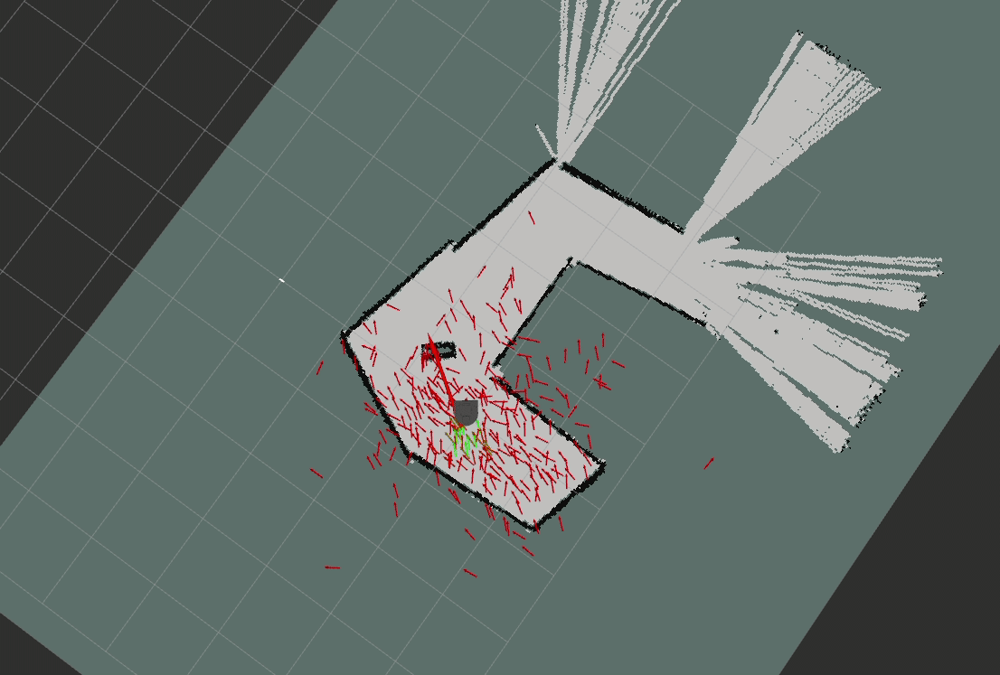
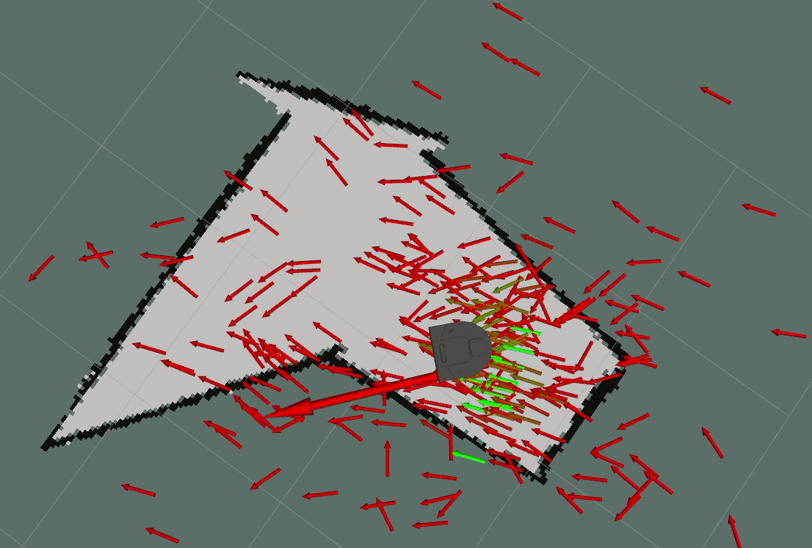
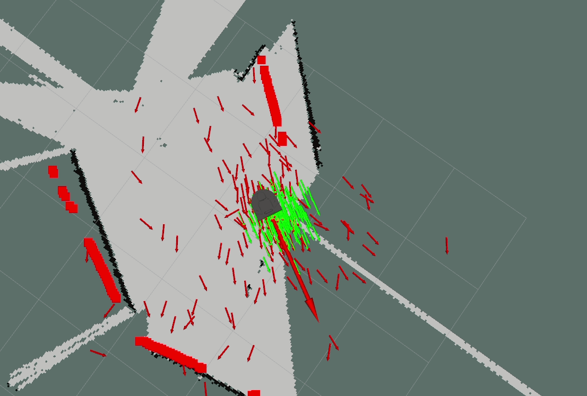


Class prompts:

<!-- How did you solve the problem? (Note: this doesn’t have to be super-detailed, you should try to explain what you did at a high-level so that others in the class could reasonably understand what you did). -->
<!-- Describe a design decision you had to make when working on your project and what you ultimately did (and why)? These design decisions could be particular choices for how you implemented some part of an algorithm or perhaps a decision regarding which of two external packages to use in your project.
What if any challenges did you face along the way?
What would you do to improve your project if you had more time?
Did you learn any interesting lessons for future robotic programming projects? These could relate to working on robotics projects in teams, working on more open-ended (and longer term) problems, or any other relevant topic. -->


